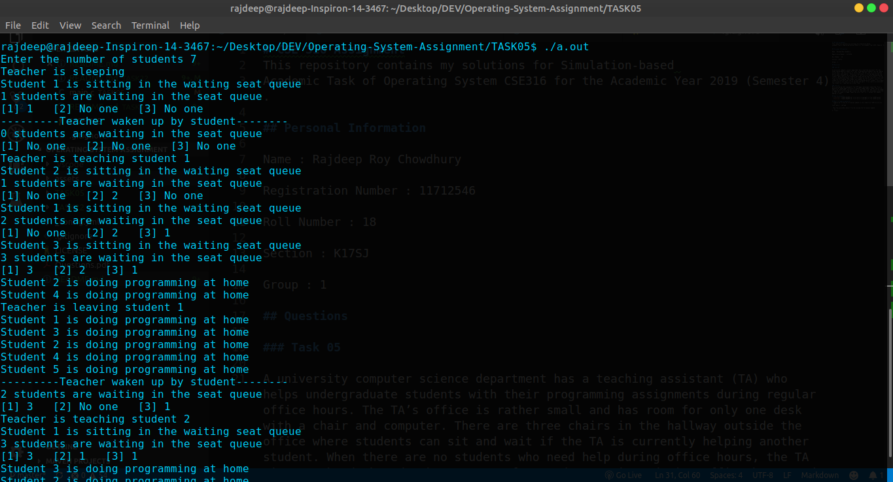

# Task 05

A university computer science department has a teaching assistant (TA) who helps undergraduate students with their programming assignments during regular office hours. The TA’s office is rather small and has room for only one desk with a chair and computer. There are three chairs in the hallway outside the office where students can sit and wait if the TA is currently helping another student. When there are no students who need help during office hours, the TA sits at the desk and takes a nap. If a student arrives during office hours and finds the TA sleeping, the student must awaken the TA to ask for help. If a student arrives and finds the TA currently helping another student, the student sits on one of the chairs in the hallway and waits. If no chairs are available, the student will come back at a later time.

## Compiling using Makefile
Make sure that you installed `make`.
For building the object file of the program, use the following command
```sh
$ make all
```

## Compiling using Command-line Interface
For compiling manually using the terminal, execute the following command
```sh
$ gcc main.c -lpthread
```

## Program Execution
### 1. Using arguments as input
For executing the compiled program using command-line arguments as input, use the following command
```sh
$ ./a.out {NUMBER_OF_STUDENTS}
```
Make sure to replace the **{NUMBER_OF_STUDENTS}** with an integer.
#### Example
```sh
$ ./a.out 7
```

### 2. Without any argument
For executing the compiled program, use the following command
```sh
$ ./a.out
```

## Screenshots

