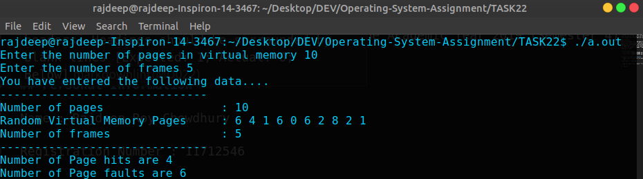
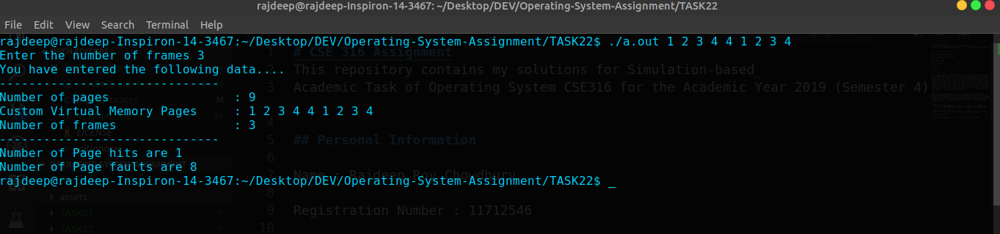

# Task 22
Write a program that implements the FIFO page replacement algorithm. First, generate a random page-reference string where page numbers range from 0 to 9. Apply the random page-reference string to each algorithm, and record the number of page faults incurred by each algorithm. Implement the replacement algorithm so that the number of page frames can vary from 1 to 7. Assume that demand paging is used.

## Compiling using Makefile
Make sure that you installed `make`.
For building the object file of the program, use the following command
```sh
$ make all
```

## Compiling using Command-line Interface
For compiling manually using the terminal, execute the following command
```sh
$ gcc main.c
```
## Modes of Execution

### 1. Random Pages Generation Mode
This mode is triggered whenever the user **does not pass any command line Argument**. The page list is automatically generated.

### 2. User Input Mode
This is mode is put to action whenever we pass **integer** type Arguments in the shell.

For more information refer to the instructions mentioned below

## Program Execution
### 1. Using arguments as input
For executing the compiled program using command-line arguments as input, use the following command
```sh
$ ./a.out {LIST_OF_VIRTUAL_MEMORY_PAGES}
```
Make sure to replace the **{LIST_OF_VIRTUAL_MEMORY_PAGES}** with space-separated integers.
#### Example
```sh
$ ./a.out 3 4 5 6 7
```

### 2. Without any argument
For executing the compiled program, use the following command
```sh
$ ./a.out
```

## Screenshots
### 1. Random Mode


### 2. User Input Mode
